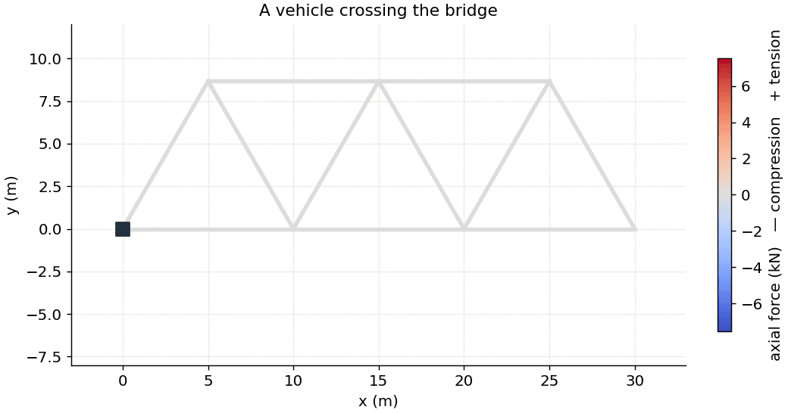
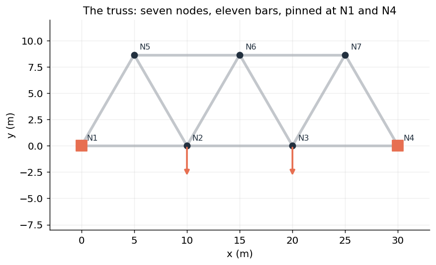
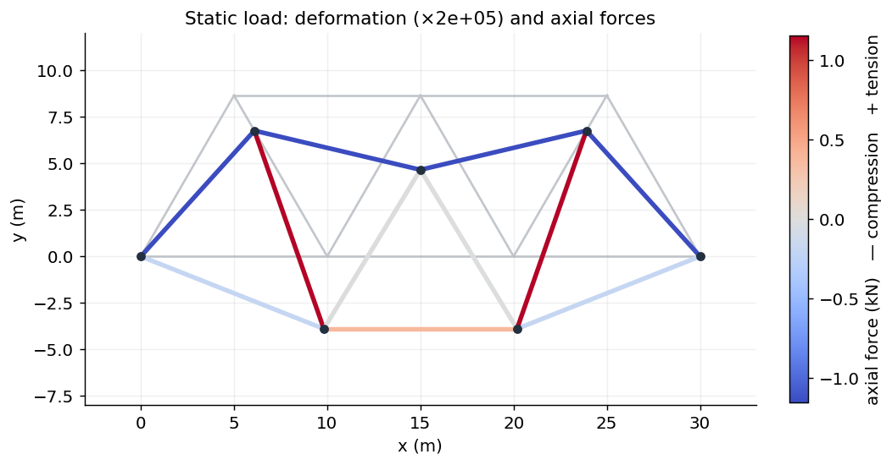
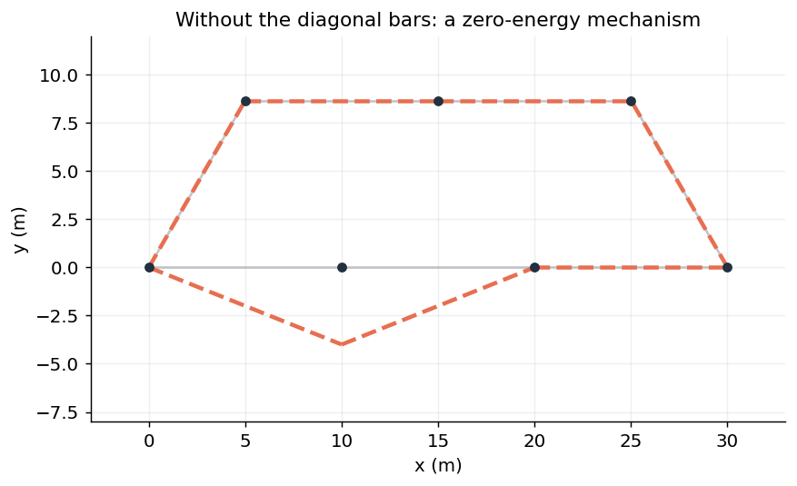
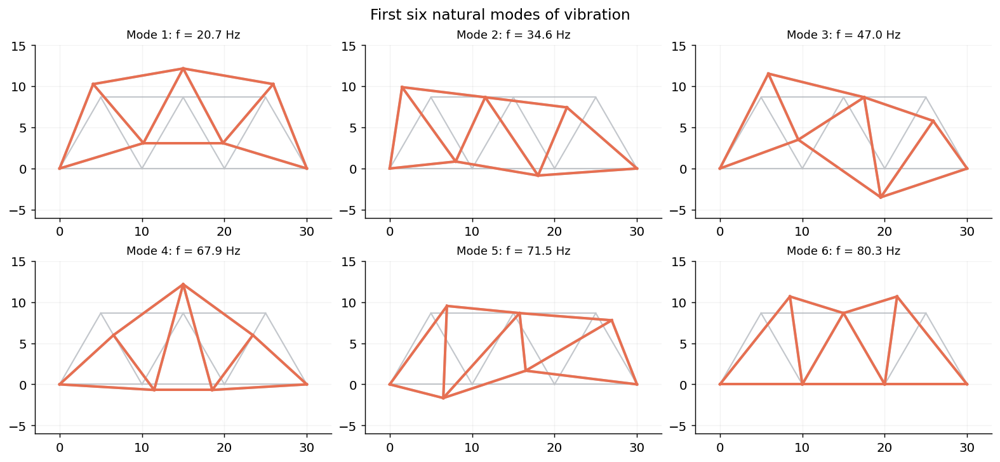

# Force distribution and natural modes of a truss bridge

A numerical study of a bridge modelled as a plane truss, using the direct
stiffness method. The project computes how forces distribute through the
structure under load, simulates a vehicle crossing together with a simple
failure criterion, adds the bars' own weight, and determines the natural modes
of vibration. It was carried out for a numerical-methods course and is shared so
that it may be read and reused.

<p align="center">
  
</p>

The bars are coloured by their axial force as the vehicle crosses: the top chord
works in compression (blue), the loaded diagonals in tension (red).

## Contents

- **[`bridge_tutorial.ipynb`](bridge_tutorial.ipynb)** — a guided walkthrough of
  the model and every result below.
- **[`truss.py`](truss.py)** — the method: assembly of the stiffness matrix,
  solution of the static problem, axial forces, and the natural modes, written
  for a general two-dimensional truss.

## The model

A truss is a set of bars joined at pins, each carrying only an axial force. With
two displacement degrees of freedom per node, the static problem is the linear
system

$$ K\,u = F, $$

where $K$ is the global stiffness matrix, assembled from the bars, $u$ the nodal
displacements, and $F$ the applied forces. The supports are imposed by holding
the corresponding displacements at zero.

The bridge has seven nodes joined into equilateral triangles, pinned at its two
ends.

<p align="center"></p>

## Selected results

**Static loading.** Under two loads on the deck, the deformed shape and the axial
force in every bar are recovered. The support reactions balance the applied load,
confirming global equilibrium.

<p align="center"></p>

**The role of the diagonals.** Removing the diagonal bars makes the reduced
stiffness matrix singular: the structure becomes a mechanism that deforms at no
cost, so the static problem has no unique solution.

<p align="center"></p>

**Natural modes.** The generalised eigenvalue problem $K\phi = \omega^2 M\phi$
gives the frequencies and shapes of vibration. The lowest modes are global
bending shapes; higher modes are more localised.

<p align="center"></p>

## Using the module

```python
import numpy as np
import truss

height = 5 * np.sqrt(3)
nodes = np.array([[0, 0], [10, 0], [20, 0], [30, 0],
                  [5, height], [15, height], [25, height]], float)
bars = [(0, 1), (1, 2), (2, 3), (3, 6), (5, 6), (4, 5),
        (0, 4), (1, 4), (1, 5), (2, 5), (2, 6)]
fixed_dofs = [0, 1, 6, 7]

K = truss.assemble_stiffness(nodes, bars, E=2e11, A=0.01)

forces = np.zeros(2 * len(nodes))
forces[3] = forces[5] = -1000                 # loads on N2 and N3
u = truss.solve_displacements(K, forces, fixed_dofs)
```

## Repository layout

```
truss-bridge/
├── bridge_tutorial.ipynb   # the guided walkthrough
├── truss.py                # the method
├── make_figures.py         # regenerates everything in figures/
├── figures/                # rendered figures and the animation
├── requirements.txt
└── LICENSE
```

## Running it

```bash
pip install -r requirements.txt
jupyter notebook bridge_tutorial.ipynb
python make_figures.py
```

## Reference

The direct stiffness method for plane trusses is a standard technique of
structural finite-element analysis.
